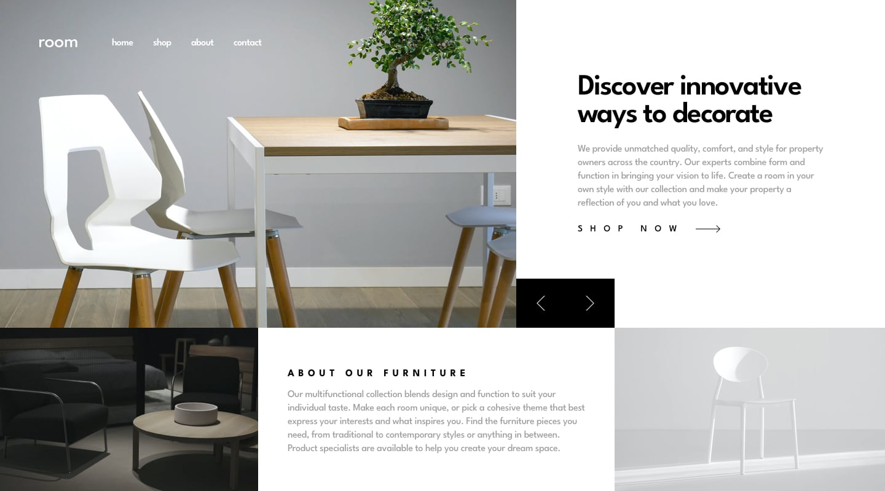

# Frontend Mentor - Room homepage solution

This is a solution to the [Room homepage challenge on Frontend Mentor](https://www.frontendmentor.io/challenges/room-homepage-BtdBY_ENq). Frontend Mentor challenges help you improve your coding skills by building realistic projects. 

## Table of contents

- [Overview](#overview)
  - [The challenge](#the-challenge)
  - [Screenshot](#screenshot)
  - [Links](#links)
- [My process](#my-process)
  - [Built with](#built-with)
  - [What I learned](#what-i-learned)
  - [Continued development](#continued-development)
  - [Useful resources](#useful-resources)
- [Author](#author)
- [Acknowledgments](#acknowledgments)

## Overview

### The challenge

Users should be able to:

- View the optimal layout for the site depending on their device's screen size
- See hover states for all interactive elements on the page
- Navigate the slider using either their mouse/trackpad or keyboard

### Screenshot

### Links

- Live Site URL: [room homepage](https://room-homepage-ecomm.netlify.app/)

## My process

### Built with

- Semantic HTML5 markup
- Scss
- Vanilla Javascript
- CSS custom properties
- Flexbox
- CSS Grid
- Mobile-first workflow
- [GulpJS](https://gulpjs.com/) - JS library for build process

### Continued development

At this stage the image slider is barebone. The page has only a few animations. The accessibility needs to be enhanced.

## Author

- Frontend Mentor - [@Mesbah214](https://www.frontendmentor.io/profile/Mesbah214)

## Acknowledgments
During the development process, I got heavily inspired from [Tediko@Github](https://github.com/tediko). You can check him out on Github. He is an experienced dev and has interesting projects on his Github.